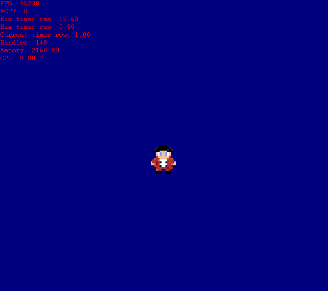

* BIG thanks to Casey Muratori (Handmade Hero) - (https://handmadehero.org/) &
* Ryan Ries on YouTube!!!!
* The following code originates from both Casey Muratori's and Ryan Ries' YouTube video series. 
* 
*	*** NOTE: SOME ASSETS IN THIS CODEBASE BELONG TO RYAN RIES. ***
*	*** THE RED CHARACTER SPRITES ARE MADE BY ME.				***
* 
* I claim none of this code as my own, the brains behind it are theirs, though I do
* plan to expand off into my own way of coding maybe using this as a base.
* By that time the base code will probably have changed quite a bit, only then will I claim to 
* be somewhat one of the brains behind the code, however, Ryan and Casey still are the main 	"sources" so 
* to speak.
* 
* Casey Muratori: https://www.youtube.com/c/MollyRocket/
* Ryan Ries:	  https://www.youtube.com/user/ryanries09
